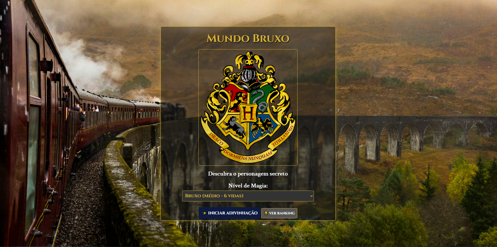

<h1 align="center">🎯 Jogo da Adivinhação - Edição Web</h1> 
  
 

   
    
   
 <h3 align="center">✨ Feito por <b>Edivone Araújo</b> e <b>Típhane Pereira</b> ✨</h3> 
<i>“Transformando lógica em diversão!”</i>

---
## 💡 Sobre o Projeto

O Jogo da Adivinhação é uma versão interativa do clássico jogo de adivinhar os personagens da franquia "Harry Potter".

---
## 🧠 Lógica principal: 

Desenvolvida em Python, responsável por gerar o número secreto, verificar palpites e contar tentativas.

---
## 💻 Interface Web ###

Criada com HTML, CSS e JavaScript, proporcionando uma experiência visual agradável e interativa.

---
## ✨ Funcionalidades

🎨 Interface web estilizada e responsiva

🎲 Geração aleatória de número secreto

🔁 Feedback em tempo real (maior, menor ou acertou)

❤️ Contador de tentativas

🔄 Botão de reiniciar o jogo

---
## 🧩 Estrutura do Projeto

jogo_da_adivinhacao/

├── animacoes/

├── imagens/

├── jogo_da_adivinhacao/

├── sons/

├── base.py/

├── index.html/

├── ranking_harry_potter.json/

├── script.js/

├── style.css/

---
## ⚙️ Como Executar Localmente

Clone o repositório:

git clone https://github.com/EdivoneAraujo/jogo_da_adivinhacao.git

Entre na pasta do projeto:

cd jogo_da_adivinhacao/src

Abra o arquivo index.html no navegador.

---
## 💡 Não é necessário servidor local — o jogo roda direto no navegador!

Para usar a lógica Python (opcional):

python ../base.py

---
## 🧠 Como Jogar

Abra o jogo no navegador

Digite um número como palpite

Receba feedback:

✅ Correto → acertou o número

❌ Errado → número maior ou menor

Continue até adivinhar o número

Clique em 🔁 Reiniciar para jogar novamente

---
## 🧰 Tecnologias Utilizadas

Tecnologia  --	Descrição

Python 3    --	Lógica principal do jogo

HTML5       --	Estrutura da interface web

CSS3	      --  Estilo e responsividade

JavaScript (ES6)  --	Interatividade e validação de palpites

---
## 💭 Melhorias Futuras

📱 Layout 100% responsivo para mobile

---
## 👩‍💻 Autoras

**Edivone Araújo e Típhane Pereira**

## 📧 Contatos:

   
 
   

💬 Desenvolvido para prática de lógica em Python e front-end interativo.

🏁 Licença
Este projeto é licenciado sob a MIT License. Sinta-se livre para estudar e adaptar!
